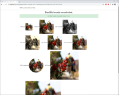

# Azure Functions

 
Beispielanwendung zum Webinar [Serverless mit Azure Functions](https://www.sdx-ag.de/2021/01/serverless-azure-functions-webinar/##news_content).

 

## Beschreibung des Codes
 
### Web-Anwendung
Initial verwendet die Web-Anwendung den `InMemoryImageFileService`, mit dem die Berechnung im Speicher durchgeführt wird.

Dies läßt sich ändern, indem in der Datei *Properties\launchSettings.json* im Web-Projekt der Eintrag `FunctionApp:Url` aktiviert wird:

	"FunctionApp:Url": "http://localhost:7071"

Soll die Function App in Azure statt lokal verwendet werden, ist die URL entsprechend anzupassen. 

### Function App 
Die Function App kann lokal gestartet werden. Falls der *Microsoft Azure Storage Emulator* nicht verfügbar ist (Teil des Azure SDK unter Windows, setzt SQL Server vorraus) muss *Azurite* (siehe [Links](#Weiterführende-Links)) oder ein *Storage Account* in Azure verwendet werden.

Die Function App nutzt initial die nicht optimierte Function `UploadImage` in der Datei *UploadImage1.cs*. 
Um die Optimierte Variante zu nutzen muss das Attribut `FunctionName` in *UploadImage1.cs* auskommentiert werden. In *UploadImage2.cs* und in *ProcessImage.cs* muss die Auskommentierung entfernt werden.    

### Sicherheit
Um die Functions abzusichern, muss in der Function App bei den Functions `UploadImage` und `GetImage` die Autorisierung von `AuthorizationLevel.Anonymous` auf `AuthorizationLevel.Function` geändert werden.

In der Konfiguration der Web-Anwendung müssen folgende Einträge ergänzt werden:

	"FunctionApp:Keys:UploadImage": "==UploadImage==",
	"FunctionApp:Keys:GetImage": "==GetImage==",
 
Die zu verwendenden Werte finden sich im Azure Portal bei der Function App unter *App Keys/Host keys (all functions)* im Eintrag *default*.

Achtung! Die Prüfung der Keys findet nur in Azure statt, bei lokaler Ausführung der Function App werden diese ignoriert.

## Weiterführende Links

* Azure Function in Azure: [https://azure.microsoft.com/de-de/services/functions/](https://azure.microsoft.com/de-de/services/functions/)
* Entwicklerdokumentation: [https://docs.microsoft.com/en-us/azure/azure-functions/functions-reference](https://docs.microsoft.com/en-us/azure/azure-functions/functions-reference)
* Azurite (Azure Storage Emulator): [https://docs.microsoft.com/en-us/azure/storage/common/storage-use-azurite](https://docs.microsoft.com/en-us/azure/storage/common/storage-use-azurite) und [https://github.com/Azure/Azurite](https://github.com/Azure/Azurite) 
* **SDX Flurfunk/Azure Functions Serie**: [https://www.sdx-ag.de/2019/08/azure-functions-wrap-up/](https://www.sdx-ag.de/2019/08/azure-functions-wrap-up/) 
 

---

